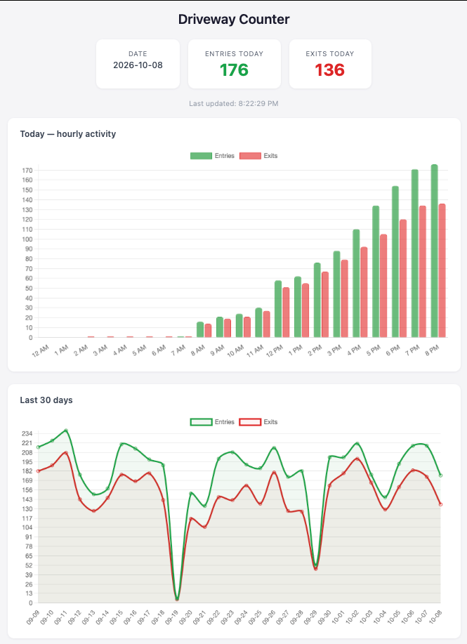

[](https://workers.cloudflare.com)
[](https://typescriptlang.org)

# Driveway Metrics

Cloudflare Worker backend for [driveway-counter](https://github.com/natonet-labs/driveway-counter). Receives hourly entry/exit snapshots from a Raspberry Pi, stores them in KV, and serves a live dashboard — accessible from anywhere without exposing the Pi to the internet.

---

## Dashboard



`src/index.html` is a static page (hosted on Cloudflare Pages) that reads from the Worker. It has three views:

| View | Description |
|---|---|
| Today's totals | Entry/exit count cards for the current day |
| Hourly activity | Intraday bar chart updated each hour |
| 30-day history | Daily entry/exit line chart |

The read endpoints require a dashboard access key. The page asks for it on first load and keeps it in that browser's local storage; if the key is rejected it clears it and asks again on reload.

The dashboard auto-refreshes every 15 minutes. Because caches are invalidated on every Pi upload, the dashboard reflects new data within seconds of each hourly sync.

---

## API Endpoints

| Method | Path | Description |
|---|---|---|
| `POST` | `/api/metrics` | Receive hourly snapshot from Pi (`Bearer CLOUDFLARE_TOKEN`) |
| `GET` | `/today` | Today's live entry/exit totals, 1 KV read (`Bearer DASHBOARD_TOKEN`) |
| `GET` | `/hourly` | Today's intraday snapshots, cached 5 min (`Bearer DASHBOARD_TOKEN`) |
| `GET` | `/dashboard` | Last 30 days of daily totals, cached 10 min (`Bearer DASHBOARD_TOKEN`) |

Both secrets fail closed: if one isn't set, its endpoints return `401`.

---

## KV Data Model

| Key pattern | TTL | Description |
|---|---|---|
| `driveway:YYYY-MM-DD` | none | Daily running total (overwritten each upload) |
| `hourly:YYYY-MM-DD:HH` | 48 h | Per-hour snapshot (auto-expires) |
| `cache:hourly:YYYY-MM-DD` | 5 min | Cached `/hourly` response |
| `cache:dashboard` | 10 min | Cached `/dashboard` response |

Caches are invalidated immediately on every Pi upload so the dashboard never shows stale data after a sync.

### KV free-tier budget

| Scenario | Ops/day |
|---|---|
| Before caching | ~55,000 |
| After caching (one tab, 5-min refresh) | ~1,350 |
| Free tier limit | 100,000 reads · 1,000 writes |

---

## Setup

### Prerequisites

- [Cloudflare account](https://dash.cloudflare.com/sign-up) (free tier is sufficient)
- [Node.js](https://nodejs.org) 18+
- Wrangler CLI: `npm install -g wrangler`

### 1 — Clone and install

```bash
git clone https://github.com/natonet-labs/driveway-metrics.git
cd driveway-metrics
npm install
```

### 2 — Create a KV namespace

```bash
wrangler kv namespace create DRIVEWAY_METRICS
```

Copy the `id` from the output and update `wrangler.jsonc`:

```jsonc
"kv_namespaces": [
  {
    "binding": "DRIVEWAY_METRICS",
    "id": "YOUR_KV_NAMESPACE_ID"
  }
]
```

### 3 — Create the API tokens

The Pi authenticates uploads with a Bearer token. Generate a secret (e.g. `openssl rand -hex 32`) and store it as a Worker secret:

```bash
wrangler secret put CLOUDFLARE_TOKEN
# Paste your token when prompted
```

Set the same value in `driveway-counter`'s `.env`:

```bash
WORKER_URL=https://driveway-metrics.YOUR_SUBDOMAIN.workers.dev/api/metrics
CLOUDFLARE_TOKEN=your_token_here
```

The dashboard uses a separate, read-only key. Generate a different value and store it too:

```bash
wrangler secret put DASHBOARD_TOKEN
```

Enter this key in the dashboard when it prompts for an access key.

### 4 — Deploy

```bash
npm run deploy
```

### Local development

```bash
npm run dev
# Worker available at http://localhost:8787
```

---

## Project Structure

```
driveway-metrics/
├── src/
│   ├── index.ts        # Worker — API routes, KV reads/writes, caching
│   └── index.html      # Dashboard UI (Chart.js, served as static asset)
├── test/
│   └── index.spec.ts   # Vitest integration tests
├── wrangler.jsonc       # Worker config — name, KV binding, compat date
└── package.json
```

---

## Companion

**[driveway-counter](https://github.com/natonet-labs/driveway-counter)** — the Pi-side application that performs YOLOv8m inference on a Hailo-8 NPU, counts driveway entries/exits, and POSTs hourly snapshots to this Worker.
